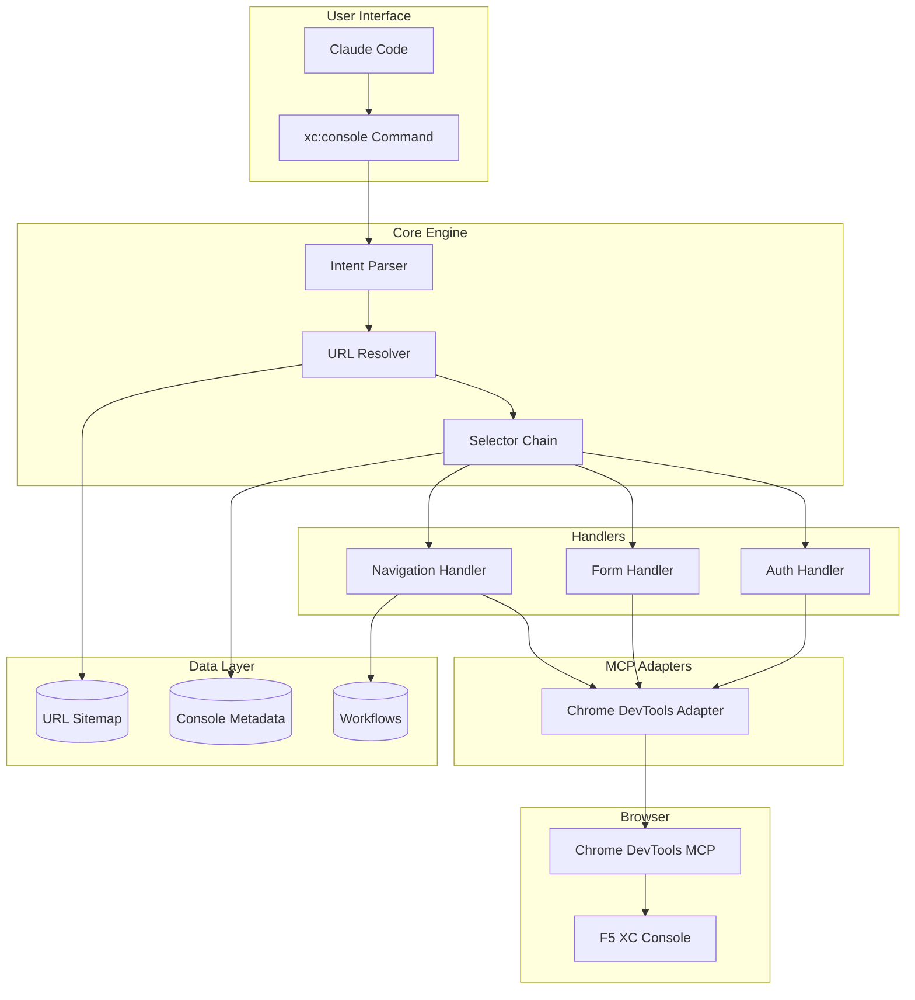
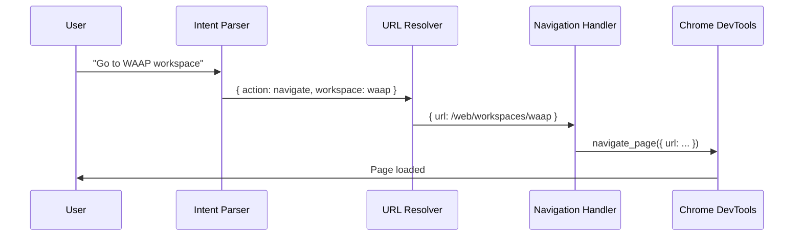
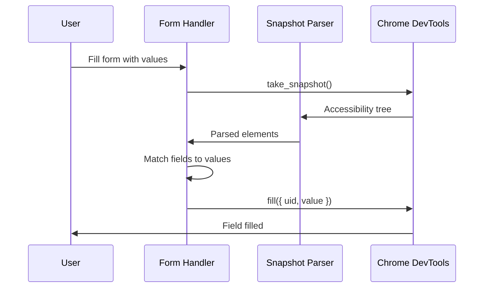

# Architecture Overview

This document describes the architecture of the F5 XC Console plugin and how its components work together.

## System Architecture



## Directory Structure

```
f5xc-console/
├── src/                      # Source code
│   ├── core/                 # Core business logic
│   │   ├── intent-parser.ts  # Natural language parsing
│   │   ├── url-resolver.ts   # URL resolution
│   │   ├── selector-chain.ts # Element selection
│   │   └── state-detector.ts # Page state detection
│   ├── handlers/             # Operation handlers
│   │   ├── auth-handler.ts   # Authentication flows
│   │   ├── form-handler.ts   # Form automation
│   │   ├── navigation-handler.ts
│   │   └── crawl-handler.ts  # Page crawling
│   ├── mcp/                  # MCP integration
│   │   ├── snapshot-parser.ts
│   │   ├── chrome-devtools-adapter.ts
│   │   └── action-executor.ts
│   ├── registry/             # Data registries
│   │   ├── url-registry.ts
│   │   ├── page-registry.ts
│   │   └── workflow-registry.ts
│   └── utils/                # Utilities
│       └── pattern-matcher.ts
├── skills/                   # Claude Code skill
│   └── xc-console/
│       ├── SKILL.md          # Skill definition
│       ├── console-navigation-metadata.json
│       ├── url-sitemap.json
│       └── workflows/        # Workflow definitions
├── tests/                    # Test suites
│   ├── unit/
│   ├── integration/
│   ├── fixtures/
│   └── helpers/
└── docs/                     # Documentation
```

## Component Details

### Core Engine

#### Intent Parser

Parses natural language commands into structured intents.

```typescript
interface ParsedIntent {
  action: 'navigate' | 'list' | 'create' | 'edit' | 'delete';
  resource: string;
  workspace?: string;
  namespace?: string;
  resource_name?: string;
  confidence: number;
}
```

**Key Features:**
- Action verb extraction (navigate, create, list, etc.)
- Resource type recognition (load balancer, origin pool, WAF)
- Namespace and name extraction
- Confidence scoring

**Example:**
```typescript
const intent = intentParser.parse('Create HTTP load balancer named frontend in production');
// {
//   action: 'create',
//   resource: 'http_loadbalancer',
//   resource_name: 'frontend',
//   namespace: 'production',
//   confidence: 0.85
// }
```

#### URL Resolver

Resolves intents to console URLs using the URL sitemap.

```typescript
interface ResolveResult {
  success: boolean;
  url: string;
  workspace?: string;
  error?: string;
}
```

**Key Features:**
- Workspace alias resolution (waap → web-app-and-api-protection)
- Resource shortcuts (http-lb → full URL path)
- Dynamic route parameter substitution
- Namespace injection

#### Selector Chain

Finds elements using a priority-ordered chain of selectors.

```typescript
interface SelectorResult {
  found: boolean;
  element?: ParsedElement;
  method: string;
  confidence: number;
}
```

**Priority Order:**
1. `name` - Element name attribute
2. `aria_label` - Accessibility label
3. `text_match` - Text content
4. `href_path` - Link URL
5. `css` - CSS selector

### Handlers

#### Navigation Handler

Orchestrates page navigation operations.

```typescript
class NavigationHandler {
  processCommand(command: string): ExecutionPlan;
  buildExecutionPlan(intent: ParsedIntent): ExecutionPlan;
  generateInstructions(plan: ExecutionPlan): Instruction[];
  checkAuthentication(snapshot: string): AuthState;
  detectPageState(snapshot: string, url: string): PageState;
}
```

#### Form Handler

Automates form field detection and filling.

```typescript
class FormHandler {
  detectFormFields(snapshot: ParsedSnapshot): FormField[];
  generateFillInstructions(snapshot: ParsedSnapshot, values: FieldValue[]): FillResult;
  generateSubmitInstruction(snapshot: ParsedSnapshot): Instruction | null;
  generateCancelInstruction(snapshot: ParsedSnapshot): Instruction | null;
}
```

**Supported Field Types:**
- `textbox` - Text inputs
- `combobox` - Dropdown selects
- `checkbox` - Boolean toggles
- `radio` - Radio buttons
- `switch` - Toggle switches

#### Auth Handler

Manages authentication state and flows.

```typescript
class AuthHandler {
  detectAuthState(snapshot: string): AuthState;
  generateLoginInstructions(provider: string): Instruction[];
  generateLogoutInstructions(): Instruction[];
}
```

**Supported Providers:**
- Azure SSO
- Google OAuth
- Okta SAML
- Native credentials

### MCP Integration

#### Snapshot Parser

Parses Chrome DevTools accessibility snapshots.

```typescript
interface ParsedSnapshot {
  url: string;
  title: string;
  elements: ParsedElement[];
  focusedUid?: string;
}

interface ParsedElement {
  uid: string;
  role: string;
  name?: string;
  value?: string;
  href?: string;
  focused?: boolean;
  disabled?: boolean;
}
```

#### Chrome DevTools Adapter

Builds MCP tool instructions for Chrome automation.

```typescript
class ChromeDevToolsAdapter {
  static buildNavigationParams(url: string, options?: NavOptions): NavigateParams;
  static buildClickParams(uid: string, options?: ClickOptions): ClickParams;
  static buildFillParams(uid: string, value: string): FillParams;
  static buildWaitParams(options: WaitOptions): WaitParams;
  static buildScreenshotParams(options?: ScreenshotOptions): ScreenshotParams;
}
```

### Data Layer

#### URL Sitemap (`url-sitemap.json`)

Contains static and dynamic routes for the console.

```json
{
  "static_routes": {
    "home": {
      "path": "/web",
      "title": "Home"
    }
  },
  "dynamic_routes": [
    {
      "pattern": "/namespaces/{namespace}/http_loadbalancers",
      "params": ["namespace"]
    }
  ],
  "workspace_mapping": {
    "waap": "/web/workspaces/web-app-and-api-protection"
  },
  "resource_shortcuts": {
    "http-lb": "/web/.../http_loadbalancers"
  }
}
```

#### Console Metadata (`console-navigation-metadata.json`)

Contains element selectors and page structure.

```json
{
  "home_page": {
    "workspace_cards": {
      "web_app_api_protection": {
        "name": "Web App & API Protection",
        "url": "/web/workspaces/web-app-and-api-protection",
        "selectors": {
          "text_match": "Web App & API Protection",
          "aria_label": "WAAP workspace"
        }
      }
    }
  }
}
```

#### Workflows (`workflows/*.md`)

Define step-by-step automation procedures.

```yaml
---
title: "Workflow: Create HTTP Load Balancer"
category: load-balancing
complexity: beginner
estimated_duration: 5-10 minutes
---

## Overview
Create a basic HTTP load balancer...

## Steps
1. Navigate to WAAP workspace
2. Go to Load Balancers
3. Click Create
...
```

## Data Flow

### Navigation Flow



### Form Filling Flow



## Extension Points

### Adding New Resources

1. Add to `url-sitemap.json`:
   ```json
   "resource_shortcuts": {
     "my-resource": "/web/.../my_resources"
   }
   ```

2. Add to `pattern-matcher.ts`:
   ```typescript
   { canonical: 'my_resource', synonyms: ['my resource', 'MR'] }
   ```

3. Add tests and documentation

### Adding New Handlers

1. Create handler class in `src/handlers/`
2. Implement standard interface
3. Add to handler index
4. Create tests in `tests/unit/handlers/`

### Adding New Workflows

1. Create markdown file in `skills/xc-console/workflows/`
2. Follow frontmatter schema
3. Define step-by-step instructions
4. Add validation tests

## Performance Considerations

### Selector Priority

Selectors are tried in priority order. Higher-confidence methods are tried first:

| Method | Confidence | Speed |
|--------|------------|-------|
| `name` | 0.95 | Fast |
| `aria_label` | 0.90 | Fast |
| `text_match` | 0.85 | Medium |
| `href_path` | 0.80 | Medium |
| `css` | 0.70 | Variable |

### Caching

- URL sitemap is cached at startup
- Parsed snapshots are per-request
- Workflow definitions are lazy-loaded

## Security Considerations

- No credentials stored in code
- SSO preferred over password auth
- Sensitive operations require confirmation
- Session tokens handled by browser
