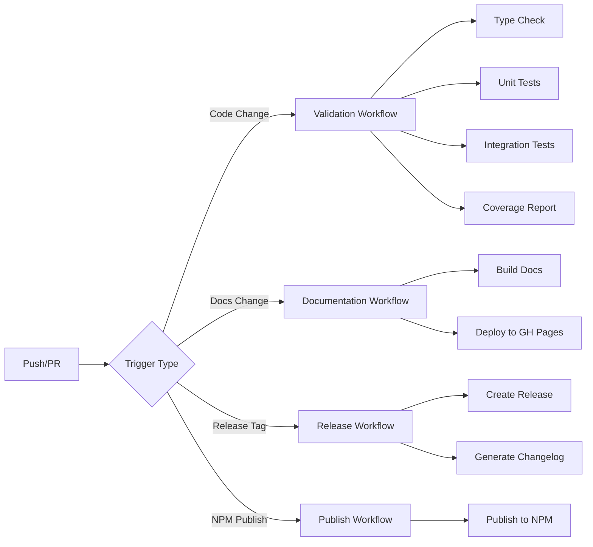

# CI/CD Pipeline

This document describes the continuous integration and deployment pipeline for the F5 XC Console plugin.

## Overview

The project uses GitHub Actions for automated testing, documentation deployment, and package publishing.



## Workflows

### Validation Workflow

**File:** `.github/workflows/validate.yml`

Runs on every push and pull request to validate code quality.

```yaml
name: Validate

on:
  push:
    branches: [main]
  pull_request:
    branches: [main]

jobs:
  test:
    runs-on: ubuntu-latest
    steps:
      - uses: actions/checkout@v4

      - name: Setup Node.js
        uses: actions/setup-node@v4
        with:
          node-version: '20'
          cache: 'npm'

      - name: Install dependencies
        run: npm ci

      - name: Run QA pipeline
        run: npm run qa

      - name: Upload coverage
        uses: codecov/codecov-action@v4
        with:
          files: ./coverage/lcov.info
```

### Documentation Workflow

**File:** `.github/workflows/docs.yml`

Deploys documentation to GitHub Pages when docs change.

```yaml
name: Documentation

on:
  push:
    branches: [main]
    paths:
      - 'docs/**'
      - 'mkdocs.yml'
      - '.github/workflows/docs.yml'
  workflow_dispatch:

permissions:
  contents: write

jobs:
  deploy:
    runs-on: ubuntu-latest
    steps:
      - uses: actions/checkout@v4
        with:
          fetch-depth: 0

      - name: Setup Python
        uses: actions/setup-python@v5
        with:
          python-version: '3.12'
          cache: 'pip'

      - name: Install dependencies
        run: pip install -r requirements-docs.txt

      - name: Deploy to GitHub Pages
        run: mkdocs gh-deploy --force --clean
```

## Test Pipeline Details

### QA Pipeline Stages

The `npm run qa` command executes these stages in sequence:

| Stage | Command | Duration | Purpose |
|-------|---------|----------|---------|
| 1 | `qa:typecheck` | ~10s | TypeScript compilation |
| 2 | `qa:unit` | ~2s | Unit tests (841 tests) |
| 3 | `qa:integration` | ~1s | Integration tests (41 tests) |
| 4 | `qa:coverage` | ~2s | Coverage report |

### Test Matrix

```yaml
strategy:
  matrix:
    node-version: [18, 20, 22]
    os: [ubuntu-latest, macos-latest]
```

### Coverage Requirements

The pipeline fails if coverage drops below these thresholds:

| Metric | Minimum |
|--------|---------|
| Statements | 80% |
| Branches | 70% |
| Functions | 80% |
| Lines | 80% |

## GitHub Actions Secrets

Required secrets for workflows:

| Secret | Purpose | Required For |
|--------|---------|--------------|
| `NPM_TOKEN` | NPM publishing | npm-publish.yml |
| `CODECOV_TOKEN` | Coverage reports | validate.yml |

## Local CI Simulation

Run the full CI pipeline locally:

```bash
# Install dependencies
npm ci

# Run full QA pipeline
npm run qa

# Build documentation locally
pip install -r requirements-docs.txt
mkdocs serve
```

## Branch Protection

Recommended branch protection rules for `main`:

- ✅ Require status checks to pass
- ✅ Require branches to be up to date
- ✅ Required checks: `test`, `docs`
- ✅ Require pull request reviews

## Deployment Environments

### GitHub Pages (Documentation)

- **URL:** https://robinmordasiewicz.github.io/f5xc-console/
- **Trigger:** Push to `main` with docs changes
- **Build:** MkDocs Material

### NPM Registry (Package)

- **Package:** `@robinmordasiewicz/f5xc-console`
- **Trigger:** Manual or release tag
- **Registry:** npmjs.com

## Monitoring

### Build Status Badges

Add to README:

```markdown
[](https://github.com/robinmordasiewicz/f5xc-console/actions/workflows/validate.yml)
[](https://github.com/robinmordasiewicz/f5xc-console/actions/workflows/docs.yml)
[](https://codecov.io/gh/robinmordasiewicz/f5xc-console)
```

### Workflow Notifications

Configure notifications in repository settings:

1. Go to Settings → Notifications
2. Enable email notifications for workflow failures
3. Configure Slack/Discord webhooks if needed

## Troubleshooting

### Common CI Failures

#### TypeScript Errors

```bash
# Check locally
npm run qa:typecheck

# View detailed errors
npx tsc --noEmit --pretty
```

#### Test Failures

```bash
# Run specific test file
npx jest tests/unit/core/intent-parser.test.ts --verbose

# Run with debugging
npx jest --detectOpenHandles --forceExit
```

#### Documentation Build Failures

```bash
# Test locally
mkdocs build --strict

# Check for broken links
mkdocs serve
# Visit http://localhost:8000 and check console
```

### Cache Issues

Clear GitHub Actions cache if builds behave unexpectedly:

1. Go to Actions → Caches
2. Delete relevant caches
3. Re-run workflow

## Performance Optimization

### Caching Strategy


```yaml
- name: Cache node modules
  uses: actions/cache@v4
  with:
    path: ~/.npm
    key: ${{ runner.os }}-node-${{ hashFiles('package-lock.json') }}
    restore-keys: |
      ${{ runner.os }}-node-

- name: Cache pip packages
  uses: actions/cache@v4
  with:
    path: ~/.cache/pip
    key: ${{ runner.os }}-pip-${{ hashFiles('requirements-docs.txt') }}
```


### Parallel Jobs

Run independent jobs in parallel:

```yaml
jobs:
  typecheck:
    runs-on: ubuntu-latest
    steps:
      - run: npm run qa:typecheck

  unit-tests:
    runs-on: ubuntu-latest
    steps:
      - run: npm run qa:unit

  integration-tests:
    runs-on: ubuntu-latest
    steps:
      - run: npm run qa:integration

  docs:
    needs: [typecheck, unit-tests, integration-tests]
    runs-on: ubuntu-latest
    steps:
      - run: mkdocs build
```

## Next Steps

- [Testing Guide](./testing.md) - Comprehensive testing documentation
- [Contributing](./contributing.md) - How to contribute
- [API Reference](../reference/api.md) - Module documentation
