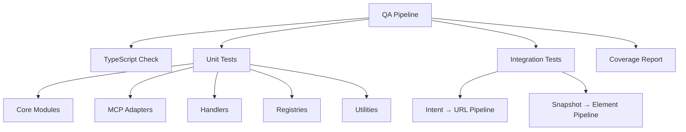

# Testing Guide

This guide covers the comprehensive QA validation framework for the F5 XC Console plugin.

## Overview

The project uses a multi-layered testing strategy with **882 tests** across unit and integration test suites, achieving **86%+ code coverage**.

| Test Type | Count | Purpose |
|-----------|-------|---------|
| Unit Tests | 841 | Individual module validation |
| Integration Tests | 41 | Component interaction testing |
| **Total** | **882** | Complete validation |

## Quick Start

### Run All Tests

```bash
# Full QA pipeline (typecheck + unit + integration + coverage)
npm run qa
```

### Run Individual Test Suites

```bash
# TypeScript compilation check
npm run qa:typecheck

# Unit tests only
npm run qa:unit

# Integration tests only
npm run qa:integration

# Coverage report
npm run qa:coverage
```

## Test Architecture



## Coverage Targets

| Category | Target | Current |
|----------|--------|---------|
| Statements | 85%+ | 86.63% |
| Branches | 75%+ | 78.99% |
| Functions | 85%+ | 89.21% |
| Lines | 85%+ | 87.28% |

## Test Categories

### Unit Tests

Located in `tests/unit/`, these test individual modules in isolation:

#### Core Modules (`tests/unit/core/`)
- `intent-parser.test.ts` - Natural language intent parsing
- `selector-chain.test.ts` - Element selector resolution

#### MCP Adapters (`tests/unit/mcp/`)
- `snapshot-parser.test.ts` - Accessibility tree parsing
- `chrome-devtools-adapter.test.ts` - MCP instruction building

#### Handlers (`tests/unit/handlers/`)
- `auth-handler.test.ts` - Authentication flow handling
- `form-handler.test.ts` - Form field detection and filling
- `navigation-handler.test.ts` - Navigation orchestration

#### Registries (`tests/unit/registry/`)
- `url-registry.test.ts` - URL resolution and shortcuts
- `page-registry.test.ts` - Page metadata queries
- `workflow-registry.test.ts` - Workflow parsing

#### Utilities (`tests/unit/utils/`)
- `pattern-matcher.test.ts` - Pattern extraction utilities

### Integration Tests

Located in `tests/integration/pipeline/`, these test component interactions:

- `intent-to-url.test.ts` - Full intent → URL resolution pipeline
- `snapshot-to-element.test.ts` - Snapshot → element finding pipeline

## Writing Tests

### Test File Structure

```
tests/
├── unit/
│   ├── core/
│   ├── mcp/
│   ├── handlers/
│   ├── registry/
│   └── utils/
├── integration/
│   └── pipeline/
├── fixtures/
├── helpers/
│   ├── snapshot-factory.ts
│   └── selector-validator.ts
└── config/
    └── jest.config.ts
```

### Creating a Unit Test

```typescript
// tests/unit/example/my-module.test.ts
import { MyModule } from '../../../src/example/my-module';

describe('MyModule', () => {
  let module: MyModule;

  beforeEach(() => {
    module = new MyModule();
  });

  describe('myMethod()', () => {
    test('should handle valid input', () => {
      const result = module.myMethod('valid');
      expect(result).toBeDefined();
      expect(result.success).toBe(true);
    });

    test('should handle invalid input gracefully', () => {
      const result = module.myMethod('');
      expect(result.success).toBe(false);
    });
  });
});
```

### Using Test Fixtures

```typescript
import {
  createTestSnapshot,
  createLoginPageSnapshot,
  createAuthenticatedHomeSnapshot,
  SnapshotBuilder
} from '../../helpers/snapshot-factory';

describe('Snapshot Tests', () => {
  test('should parse login page', () => {
    const snapshot = createLoginPageSnapshot();
    const parsed = parser.parse(snapshot);

    expect(parsed.elements.length).toBeGreaterThan(0);
  });

  test('should create custom snapshot', () => {
    const snapshot = new SnapshotBuilder()
      .withUrl('https://example.com')
      .withTitle('Test Page')
      .addElement({ uid: 'btn1', role: 'button', name: 'Submit', level: 1 })
      .build();

    expect(snapshot).toContain('[btn1] button "Submit"');
  });
});
```

## Test Patterns

### Intent Parser Testing

```typescript
import { IntentParser } from '../../../src/core/intent-parser';

describe('Intent Parser', () => {
  const parser = new IntentParser();

  // Action extraction
  test('should parse navigate action', () => {
    const intent = parser.parse('Go to WAAP workspace');
    expect(intent.action).toBe('navigate');
  });

  // Resource extraction
  test('should extract resource type', () => {
    const intent = parser.parse('Create HTTP load balancer');
    expect(intent.resource).toContain('loadbalancer');
  });

  // Namespace extraction
  test('should extract namespace', () => {
    const intent = parser.parse('List LBs in production namespace');
    expect(intent.namespace).toBe('production');
  });
});
```

### URL Registry Testing

```typescript
import { URLRegistry } from '../../../src/registry/url-registry';

describe('URL Registry', () => {
  const registry = new URLRegistry();

  test('should resolve workspace alias', () => {
    const result = registry.resolveWorkspace('waap');
    expect(result.found).toBe(true);
    expect(result.url).toContain('web-app-and-api-protection');
  });

  test('should resolve resource shortcut with namespace', () => {
    const result = registry.resolveShortcut('http-lb', {
      namespace: 'production'
    });
    expect(result.success).toBe(true);
    expect(result.url).toContain('/production/');
  });
});
```

### Snapshot Parser Testing

```typescript
import { SnapshotParser } from '../../../src/mcp/snapshot-parser';
import { createTestSnapshot } from '../../helpers/snapshot-factory';

describe('Snapshot Parser', () => {
  const parser = new SnapshotParser();

  test('should find elements by role', () => {
    const snapshot = createTestSnapshot([
      { uid: 'btn1', role: 'button', name: 'Save', level: 1 },
      { uid: 'btn2', role: 'button', name: 'Cancel', level: 1 },
    ]);

    const parsed = parser.parse(snapshot);
    const buttons = parser.findByRole(parsed, 'button');

    expect(buttons.length).toBe(2);
  });

  test('should find element by text', () => {
    const snapshot = createTestSnapshot([
      { uid: 'link1', role: 'link', name: 'Documentation', level: 1 },
    ]);

    const parsed = parser.parse(snapshot);
    const [doc] = parser.findByText(parsed, 'Documentation');

    expect(doc.uid).toBe('link1');
  });
});
```

## Determinism Requirements

All tests must be deterministic:

- ✅ No timing-dependent assertions
- ✅ No external service dependencies
- ✅ Mocked file I/O for registry tests
- ✅ Fixture-based snapshot tests
- ✅ 100% pass rate across 10+ consecutive runs

### Verifying Determinism

```bash
# Run tests 10 times to verify determinism
for i in {1..10}; do npm run qa:unit --silent; done
```

## Jest Configuration

The Jest configuration is located at `tests/config/jest.config.ts`:

```typescript
import type { Config } from 'jest';

const config: Config = {
  preset: 'ts-jest',
  testEnvironment: 'node',
  rootDir: '../..',
  testMatch: [
    '<rootDir>/tests/unit/**/*.test.ts',
    '<rootDir>/tests/integration/pipeline/**/*.test.ts'
  ],
  collectCoverage: true,
  coverageDirectory: '<rootDir>/coverage',
  coverageReporters: ['text', 'lcov', 'html'],
  verbose: true,
  testTimeout: 10000,
};

export default config;
```

## Continuous Integration

Tests run automatically on every push via GitHub Actions. See the [CI/CD documentation](./ci-cd.md) for details.

## Troubleshooting

### Common Issues

#### TypeScript Compilation Errors

```bash
# Check for type errors
npm run qa:typecheck

# Fix common issues
npm run build
```

#### Test Timeout

Increase timeout for slow tests:

```typescript
test('slow operation', async () => {
  // ...
}, 30000); // 30 second timeout
```

#### Coverage Below Threshold

Run coverage report to identify gaps:

```bash
npm run qa:coverage
# View HTML report at coverage/lcov-report/index.html
```

## Next Steps

- [CI/CD Pipeline](./ci-cd.md) - Automated testing workflow
- [Contributing](./contributing.md) - How to contribute tests
- [API Reference](../reference/api.md) - Module documentation
