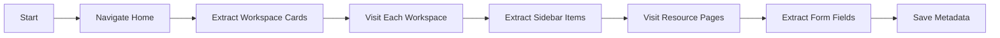

# Console Crawling

The plugin can crawl the F5 XC console to extract navigation metadata.

## Overview

Console crawling builds the `console-navigation-metadata.json` and `url-sitemap.json` files that enable deterministic navigation.

!!! info "Pre-Crawled Metadata"
    The plugin ships with pre-crawled metadata that works out of the box. Crawling is **optional** - use it to refresh stale data or update after F5 XC console UI changes.

## Running a Crawl

```bash
/xc:console crawl https://yourname.console.ves.volterra.io
```

## What Gets Extracted

### URL Sitemap

- **Static Routes** - Fixed paths like `/web/home`, `/web/workspaces/...`
- **Dynamic Routes** - Paths with variables like `/namespaces/{namespace}/...`
- **Workspace Mapping** - Shorthand aliases
- **Resource Shortcuts** - Quick navigation helpers

### Element Metadata

- **Element Refs** - Session-specific references
- **Stable Selectors** - Cross-session selectors
  - `data_testid` - Testing attributes
  - `aria_label` - Accessibility labels
  - `text_match` - Text content
  - `css` - CSS selectors

## Crawl Coverage

{{ console_stats() }}

## Crawl Process



## Refreshing Metadata

Run a crawl when:

- Console UI has been updated
- New workspaces are added
- Form fields change
- Navigation paths move

```bash
# Full crawl
/xc:console crawl https://yourname.console.ves.volterra.io

# Verify updated metadata
cat skills/xc-console/console-navigation-metadata.json | jq .version
```
