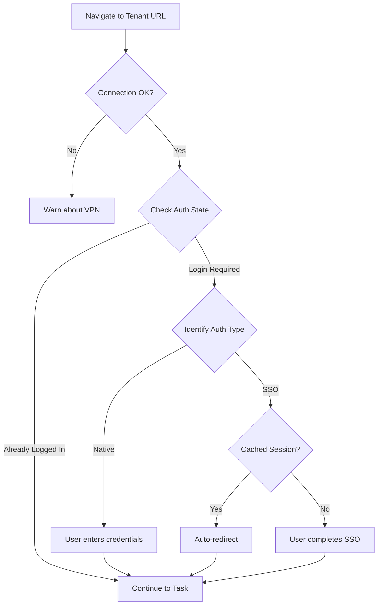

# Authentication

The plugin supports multiple authentication providers for F5 XC console access.

## Supported Providers

| Auth Type | URL Pattern | Claude Can Automate? |
|-----------|-------------|---------------------|
| Native U/P | `login*.volterra.us` | ❌ User enters creds |
| Azure SSO | `login.microsoftonline.com` | ⚠️ Only if cached |
| Google SSO | `accounts.google.com` | ⚠️ Only if cached |
| Okta SSO | `*.okta.com` | ⚠️ Only if cached |
| Generic SAML | `/saml/`, `/sso/` | ⚠️ Only if cached |
| Already Logged In | `/web/workspaces/` | ✅ Yes |
| Connection Failed | timeout/error | ❌ Warn about VPN |

## Auto-Flow Sequence



## Detection Triggers

The plugin detects login requirements when:

- URL redirects to login page (`login*.volterra.us`, `login.microsoftonline.com`, etc.)
- Page contains "Sign in", "Go to login", or "Session expired" messages
- Connection times out (may require VPN)

## Handling Authentication

### Automatic (Cached Sessions)

If you have an active browser session, the plugin uses it automatically:

```bash
/xc:console login https://yourname.console.ves.volterra.io

# Claude will detect existing session and proceed
```

### Manual (Credentials Required)

When credentials are needed:

```bash
/xc:console login https://yourname.console.ves.volterra.io

# Claude: "I see a login page. Azure SSO button is visible."
# You: Click SSO button and complete authentication
# Tell Claude: "I've logged in, continue with the task"
```

## VPN Requirements

Some tenants require VPN access. The plugin detects connection timeouts and warns:

```
⚠️ Connection timeout detected. This tenant may require VPN access.
Please ensure you're connected to the appropriate VPN and try again.
```
